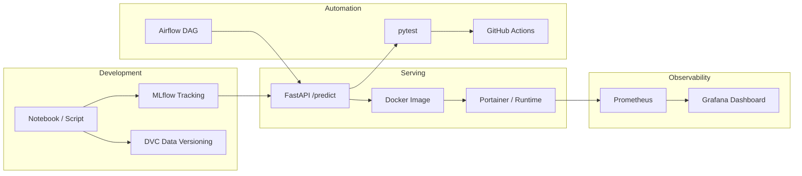

# MLOps Internship — Learning Guide & Practice Lab

> **Your mission:** Take a machine learning model from a notebook experiment to a production-grade, observable, automated system. This README is your map. You write the code — this document explains *why*, *how*, and *what to practice*.

---

## Table of Contents

1. [What Is MLOps?](#what-is-mlops)
2. [The Big Picture](#the-big-picture)
3. [Phase 1 — Packaging & Serving](#phase-1--packaging--serving)
4. [Phase 2 — Tracking & Versioning](#phase-2--tracking--versioning)
5. [Phase 3 — CI/CD (Automation)](#phase-3--cicd-automation)
6. [Phase 4 — Orchestration & Infrastructure](#phase-4--orchestration--infrastructure)
7. [Phase 5 — Monitoring & Observability](#phase-5--monitoring--observability)
8. [Suggested Project Structure](#suggested-project-structure)
9. [Practice Exercises (By Difficulty)](#practice-exercises-by-difficulty)
10. [Troubleshooting Cheat Sheet](#troubleshooting-cheat-sheet)
11. [Further Reading](#further-reading)

---

## What Is MLOps?

**MLOps** (Machine Learning Operations) is the set of practices that bridge the gap between *building a model in a notebook* and *running it reliably in production*.

A data scientist's job often ends at "the model works on my laptop." In the real world, other teams need to:

- Call your model from a mobile app, a web backend, or a batch job
- Know which version of the model is live and how it was trained
- Reproduce an experiment from three months ago
- Catch bugs before deployment
- Notice when predictions drift or latency spikes

MLOps is not one tool — it is a **lifecycle**:

```
Experiment → Track → Package → Test → Deploy → Monitor → Retrain → Repeat
```

Each phase in this repo maps to one slice of that lifecycle.

---

## The Big Picture



| Phase | Core Question It Answers |
|-------|--------------------------|
| 1 — Packaging & Serving | *How do other systems talk to my model?* |
| 2 — Tracking & Versioning | *How do I remember what I trained and on what data?* |
| 3 — CI/CD | *How do I catch mistakes before they reach production?* |
| 4 — Orchestration | *How do I run multi-step pipelines on a schedule?* |
| 5 — Monitoring | *How do I know the service is healthy in the wild?* |

---

## Phase 1 — Packaging & Serving

### Goal

Take a model out of a Jupyter Notebook and make it a **software service** that other applications can talk to over HTTP.

### Concepts to Understand

| Concept | Plain English |
|---------|---------------|
| **Inference API** | A web endpoint that accepts input features and returns a prediction |
| **Serialization** | Saving a trained model to disk (`joblib`, `pickle`) so you can load it without retraining |
| **Container** | A lightweight, portable box that bundles your app + dependencies + runtime |
| **Reverse proxy / port mapping** | How traffic from your host machine reaches a process inside a container |

### Checkpoints

#### The API Wrapper

Train a dead-simple `scikit-learn` model (e.g. Random Forest on the Iris dataset). Write a **FastAPI** application with a `/predict` endpoint that:

1. Accepts JSON input (feature values)
2. Passes data to the loaded model
3. Returns the prediction as JSON

**Design decisions you should make yourself:**

- Where does training happen? (separate script vs. at startup)
- What does your request/response schema look like? (Pydantic models help)
- What HTTP status codes do you return for bad input vs. server errors?

#### The Container

Write a `Dockerfile` for your FastAPI app. Build the image locally and ensure it runs without crashing.

**Key Dockerfile ideas:**

- Use a slim Python base image
- Copy `requirements.txt` first (layer caching)
- Expose the port your app listens on
- Use `CMD` or `ENTRYPOINT` to start Uvicorn

#### The Local Deployment

Deploy the built container into your existing **Portainer** environment. Verify from your host with `curl` or Postman.

### Practice Examples — Phase 1

| # | Exercise | What You'll Learn |
|---|----------|-------------------|
| 1.1 | Add a `GET /health` endpoint that returns `{"status": "ok"}` | Liveness checks — every production service needs one |
| 1.2 | Accept a **batch** of samples in one request (list of feature vectors) | Real APIs often score many rows at once |
| 1.3 | Return **class probabilities** alongside the predicted label | Clients often need confidence, not just the argmax |
| 1.4 | Add input validation: reject negative sepal lengths, wrong number of features | Fail fast with `422 Unprocessable Entity` |
| 1.5 | Pin exact versions in `requirements.txt` and rebuild the image — notice when nothing breaks | Reproducible environments |
| 1.6 | Run **two containers** on different ports serving the same image | Simulating blue/green or A/B deployments |
| 1.7 | Break the model file on purpose — does the container crash at startup or at first request? | Fail-fast vs. lazy-loading tradeoffs |

### Verification Checklist

- [ ] `curl -X POST http://localhost:<port>/predict -H "Content-Type: application/json" -d '{"features": [5.1, 3.5, 1.4, 0.2]}'` returns a prediction
- [ ] Container restarts cleanly after `docker stop` / `docker start`
- [ ] Portainer shows the container as healthy/running
- [ ] API works the same inside Docker as when run locally with Uvicorn

---

## Phase 2 — Tracking & Versioning

### Goal

Stop relying on memory or filenames like `model_final_v3_really.pkl`. **Track experiments** and **version datasets** systematically.

### Concepts to Understand

| Concept | Plain English |
|---------|---------------|
| **Experiment tracking** | Logging params, metrics, and artifacts for every training run |
| **Artifact** | A file produced by a run (model weights, plots, etc.) |
| **Data versioning** | Storing large files outside Git while keeping a pointer (`.dvc` file) in Git |
| **Remote storage** | Where DVC pushes the actual bytes (local folder, S3, GCS, etc.) |

### Checkpoints

#### The MLflow Run

Spin up a local MLflow tracking server. Write a Python script that trains a model with **three different hyperparameter sets**. For each run, log:

- Parameters (e.g. `n_estimators`, `max_depth`)
- Final accuracy (or another metric)
- The model artifact itself

Open the MLflow UI and compare runs side by side.

#### The DVC Commit

Initialize DVC in this Git repository. Track a sample CSV dataset with `dvc add`. Push the data to a **local dummy remote** (another folder on your machine). Commit the resulting `.dvc` file and `dvc.lock` to Git — not the CSV itself.

### Practice Examples — Phase 2

| # | Exercise | What You'll Learn |
|---|----------|-------------------|
| 2.1 | Log a **confusion matrix** or **feature importances** as an MLflow artifact | Artifacts aren't just models |
| 2.2 | Tag your best run as `production-candidate` in MLflow | Human-readable promotion workflow |
| 2.3 | Use `mlflow.sklearn.log_model` and load the model back with `mlflow.pyfunc.load_model` | Round-trip artifact integrity |
| 2.4 | Change one hyperparameter and re-run — confirm the UI shows 4 runs, not 3 | Experiment comparison |
| 2.5 | Delete the local CSV, run `dvc pull` — data reappears | Why DVC exists |
| 2.6 | Modify the CSV, run `dvc status` — see what changed before you commit | Data diff awareness |
| 2.7 | Store your `mlruns/` directory outside the repo and point `MLFLOW_TRACKING_URI` there | Separating tracking storage from code |

### Verification Checklist

- [ ] MLflow UI loads at `http://localhost:5000` (or your chosen port)
- [ ] Three runs visible with different params and metrics
- [ ] You can download/view the logged model from the UI
- [ ] `git status` shows `.dvc` files but **not** the large CSV
- [ ] `dvc push` then `dvc pull` on a fresh clone restores the data

---

## Phase 3 — CI/CD (Automation)

### Goal

Automate testing and building so you **catch errors before they reach production**.

### Concepts to Understand

| Concept | Plain English |
|---------|---------------|
| **Unit test** | A small, automated check of one behavior |
| **Integration test** | Tests that hit your real HTTP endpoints (often with `TestClient`) |
| **CI pipeline** | A script that runs on every push: install deps → lint → test → (optionally) build |
| **Fail fast** | Broken code should block the merge, not reach Portainer |

### Checkpoints

#### The Unit Test

Write **pytest** tests for your FastAPI `/predict` endpoint. Explicitly test **bad inputs**:

- Missing JSON fields
- Wrong types (string instead of float)
- Empty body
- Malformed JSON

The API should return a proper error response (e.g. `422`), **not** a 500 crash.

#### The Pipeline

Create `.github/workflows/main.yml`. On every push:

1. Checkout code
2. Set up Python
3. Install requirements
4. Run `pytest`

### Practice Examples — Phase 3

| # | Exercise | What You'll Learn |
|---|----------|-------------------|
| 3.1 | Test the happy path: valid Iris features → `200` + prediction key in response | Baseline coverage |
| 3.2 | Test `GET /health` returns 200 | Multi-endpoint test suites |
| 3.3 | Use `pytest.parametrize` to send 5 different invalid payloads in one test | DRY test design |
| 3.4 | Add a test that mocks a missing model file — what should happen? | Error-handling contracts |
| 3.5 | Add a **linting** step (`ruff` or `flake8`) to the GitHub Action | Code quality gates |
| 3.6 | Cache pip dependencies in the workflow | Faster CI (optional optimization) |
| 3.7 | Intentionally break a test, push, and watch the Action fail — then fix it | Closing the feedback loop |

### Verification Checklist

- [ ] `pytest` passes locally
- [ ] At least one test asserts `422` (or similar) for bad input
- [ ] GitHub Actions tab shows a green run after push
- [ ] A deliberate test failure turns the workflow red

---

## Phase 4 — Orchestration & Infrastructure

### Goal

Schedule and **chain tasks together reliably** instead of manually running scripts in order.

### Concepts to Understand

| Concept | Plain English |
|---------|---------------|
| **DAG** | Directed Acyclic Graph — tasks with dependencies, no cycles |
| **Operator** | A single unit of work in Airflow (e.g. `PythonOperator`) |
| **Scheduler** | Decides *when* to run DAGs |
| **Executor** | Decides *where* tasks run (locally: `SequentialExecutor` or `LocalExecutor`) |
| **Idempotency** | Re-running a task should be safe (overwrite, not duplicate corrupt data) |

### Checkpoints

#### The Airflow DAG

Install Apache Airflow locally. Write a DAG with **three PythonOperators**:

1. **Generate/download** dummy data (write a CSV)
2. **Train** a model on that data
3. **Save** the model to a specific directory

Define clear dependencies: `task1 >> task2 >> task3`.

#### The Execution

Trigger the DAG from the Airflow UI. Verify all three tasks succeed **in sequence**.

### Practice Examples — Phase 4

| # | Exercise | What You'll Learn |
|---|----------|-------------------|
| 4.1 | Pass the output path of task 1 to task 2 via **XCom** | Inter-task data passing |
| 4.2 | Add a `BashOperator` that prints `ls -la` on the model directory after task 3 | Mixing operator types |
| 4.3 | Schedule the DAG to run **daily at 8 AM** using a cron expression | Scheduled retraining |
| 4.4 | Make task 2 fail on purpose — observe task 3 does **not** run | Dependency enforcement |
| 4.5 | Add retry logic (`retries=2`) to the training task | Resilience to transient failures |
| 4.6 | Parameterize the DAG with a `model_name` Airflow Variable | Config without code changes |
| 4.7 | Wire the saved model path to match where your Phase 1 API loads from | End-to-end pipeline integration |

### Verification Checklist

- [ ] Airflow UI accessible (default: `http://localhost:8080`)
- [ ] DAG appears in the list (no import errors in logs)
- [ ] Manual trigger runs all 3 tasks green
- [ ] Model file exists at the expected path after a successful run
- [ ] Re-triggering the DAG overwrites or versions the model predictably

---

## Phase 5 — Monitoring & Observability

### Goal

Keep an eye on your model in production: **latency**, **throughput**, and **resource usage** — not just accuracy on a static test set.

### Concepts to Understand

| Concept | Plain English |
|---------|---------------|
| **Metrics** | Numeric time-series (requests/sec, latency histograms) |
| **Instrumentation** | Code or middleware that exposes those metrics |
| **Scrape** | Prometheus periodically pulls `/metrics` from your app |
| **Dashboard** | Grafana visualizes Prometheus data |
| **RED method** | Rate, Errors, Duration — a simple framework for service health |

### Checkpoints

#### The Metrics Exporter

Add `prometheus-fastapi-instrumentator` to your Phase 1 API. This automatically exposes a `/metrics` endpoint.

#### The Dashboard

Spin up **Prometheus** and **Grafana**. Configure Prometheus to scrape your API. Build a Grafana dashboard with:

- **Requests Per Second**
- **Average Response Time** (or p50/p95 latency)

#### The Local Integration (Bonus)

Point Prometheus at your local **Ollama** instance. Build a Grafana panel showing resource consumption spikes during text generation.

### Practice Examples — Phase 5

| # | Exercise | What You'll Learn |
|---|----------|-------------------|
| 5.1 | `curl` your `/metrics` endpoint and identify `http_requests_total` | Raw Prometheus exposition format |
| 5.2 | Generate load with a simple loop (`for i in {1..100}; do curl ...; done`) and watch RPS climb | Metrics reflect reality |
| 5.3 | Add a custom counter for **prediction class distribution** (setosa vs versicolor vs virginica) | Business-level observability |
| 5.4 | Create a Grafana **alert** when average latency exceeds 500ms | From dashboards to paging |
| 5.5 | Compare metrics from the API running in Docker vs. bare Uvicorn | Container overhead visibility |
| 5.6 | Scrape Ollama's metrics endpoint and plot CPU/memory during a long `ollama run` prompt | Multi-service monitoring |
| 5.7 | Document your PromQL queries in the README or a `docs/monitoring.md` | Operational runbooks |

### Verification Checklist

- [ ] `GET /metrics` returns Prometheus text format
- [ ] Prometheus "Targets" page shows your API as **UP**
- [ ] Grafana dashboard updates when you send traffic
- [ ] (Bonus) Ollama panel shows a visible spike during generation

---

## Suggested Project Structure

Organize your work as you go — you decide the exact names:

```
HuaweiIntern/
├── README.md                 # ← you are here
├── .github/
│   └── workflows/
│       └── main.yml          # Phase 3 — CI pipeline
├── app/
│   ├── main.py               # Phase 1 — FastAPI app
│   ├── train.py              # Phase 1 — train & serialize model
│   └── models/               # Serialized model artifacts
├── tests/
│   └── test_predict.py       # Phase 3 — pytest suite
├── scripts/
│   └── mlflow_train.py       # Phase 2 — experiment logging
├── dags/
│   └── ml_pipeline_dag.py    # Phase 4 — Airflow DAG
├── data/
│   └── iris.csv.dvc          # Phase 2 — DVC pointer (not the raw CSV in Git)
├── docker/
│   ├── Dockerfile            # Phase 1 — container definition
│   └── docker-compose.yml    # Phase 5 — API + Prometheus + Grafana
├── monitoring/
│   ├── prometheus.yml        # Phase 5 — scrape config
│   └── grafana/              # Phase 5 — dashboard JSON (optional)
├── requirements.txt
└── .dvc/                     # Phase 2 — DVC config
```

This is a **suggestion**, not a requirement. The learning outcome matters more than the folder names.

---

## Practice Exercises (By Difficulty)

### Beginner — Do These First

1. Train Iris Random Forest, expose `/predict`, verify with `curl`
2. Log one MLflow run with params + accuracy
3. Write one pytest that expects `422` on bad JSON
4. Trigger your Airflow DAG once manually

### Intermediate — After Checkpoints Pass

5. Dockerize the API and deploy via Portainer
6. Run three MLflow experiments and pick the best in the UI
7. Full DVC workflow: `add` → `push` → clone fresh → `pull`
8. GitHub Action runs green on every push
9. Grafana dashboard with RPS + latency panels

### Advanced — Stretch Goals

10. **End-to-end story:** Airflow trains → saves model → API hot-reloads or restarts with new weights
11. **Contract testing:** Publish an OpenAPI schema and validate responses in CI
12. **Load test:** Use `locust` or `hey` and document breaking point (RPS before p95 > 1s)
13. **Drift detection stub:** Log incoming feature means to Prometheus; alert if sepal length mean shifts
14. **Multi-stage Dockerfile:** Separate build and runtime stages for a smaller image
15. **Secrets:** Store MLflow URI and DVC remote path in env vars, never hardcode

---

## Troubleshooting Cheat Sheet

| Symptom | Likely Cause | What to Check |
|---------|--------------|---------------|
| `422 Unprocessable Entity` | Pydantic validation failed | Request body schema vs. your model |
| `500` on `/predict` | Model not loaded, wrong feature shape | Server logs, `model.n_features_in_` |
| Container exits immediately | Wrong `CMD`, missing dep, port conflict | `docker logs <container>` |
| Can't reach API from host | Port not published in Portainer | Host port mapping `8080:8000` |
| MLflow UI empty | Wrong tracking URI, runs logged elsewhere | `echo $MLFLOW_TRACKING_URI` |
| `dvc push` fails | Remote not configured or path wrong | `dvc remote list`, `dvc remote modify` |
| Airflow DAG missing | Import error in DAG file | Airflow scheduler logs |
| Prometheus target DOWN | Wrong host (use service name in Docker network) | `prometheus.yml` targets |
| Grafana "No data" | Time range, wrong datasource, no traffic yet | Send requests, check Prometheus graph |
| GitHub Action fails on `pip install` | Missing or conflicting `requirements.txt` | Pin versions, test in a fresh venv |

---

## Further Reading

| Topic | Resource |
|-------|----------|
| FastAPI | [https://fastapi.tiangolo.com/](https://fastapi.tiangolo.com/) |
| Docker | [https://docs.docker.com/get-started/](https://docs.docker.com/get-started/) |
| MLflow | [https://mlflow.org/docs/latest/index.html](https://mlflow.org/docs/latest/index.html) |
| DVC | [https://dvc.org/doc/start](https://dvc.org/doc/start) |
| pytest + FastAPI | [https://fastapi.tiangolo.com/tutorial/testing/](https://fastapi.tiangolo.com/tutorial/testing/) |
| GitHub Actions | [https://docs.github.com/en/actions](https://docs.github.com/en/actions) |
| Apache Airflow | [https://airflow.apache.org/docs/](https://airflow.apache.org/docs/) |
| Prometheus | [https://prometheus.io/docs/introduction/overview/](https://prometheus.io/docs/introduction/overview/) |
| Grafana | [https://grafana.com/docs/grafana/latest/](https://grafana.com/docs/grafana/latest/) |
| prometheus-fastapi-instrumentator | [https://github.com/trallnag/prometheus-fastapi-instrumentator](https://github.com/trallnag/prometheus-fastapi-instrumentator) |

---

## How to Use This Repo

1. **Read one phase** — understand the concepts table before writing code
2. **Complete the checkpoints** — these are your minimum viable MLOps stack
3. **Pick 2–3 practice exercises** per phase — depth beats speed
4. **Check off verification lists** — if you can't verify it, it's not done
5. **Commit often** — small commits per checkpoint make debugging easier

You've got the map. Now build the machine.
